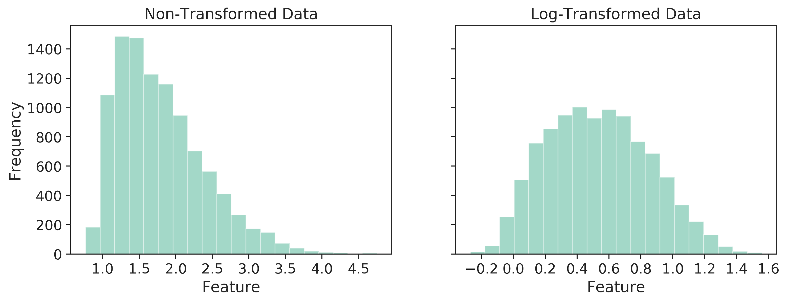

# Data Transformation
Data transformation is a process of performing a mathematical function on each data point used in a statistical or machine learning analysis to either satisfy the underlying assumptions of a statistical test (e.g., normal distribution for a t-test) or help a machine-learning algorithm to converge faster. In addition to statistical analyses and modeling, data transformation can also be helpful in data visualization, for example, performing a log transformation on a skewed data set to plot it in a relatively unskewed and visually appealing scatter plot. Most of the data transformation methods are invertible and original values of a data set can be recovered by implementing a counter mathematical function. In mathematical form it can be expressed as:

`x' = f(x)`

Where `x` is the original data, `x'` is the transformed data, and `f(x)` is a mathematical function performed on `x`.

In data science, data transformation is also sometimes combined with the data cleaning step. In addition to performing a mathematical function to the data points, they are also checked for quality, for example, checking for missing values. I will discuss data cleaning procedures elsewhere. Data transformation can be considered as an umbrella term for both data scaling and data normalization. They are frequently used interchangeably, sometimes referring to the same mathematical operation. Although data scaling and normalization are used to achieve a  similar result, it is better to understand them as two different operations that are happening under the hood.

# Types of Data Transformation
Although every data transformation method performs a mathematical operation on every data point, for some, this operation is not influenced if data points are either removed or added to the data set. Let's consider a data set in the form of a two-dimensional data table with samples on the row and features on the column. Now take two methods to compare 1) log transformation 2) min-max scaling. In log transformation `log(x)`, a log is taken for every data point individually, and the result will not change if some rows or columns are dropped or added in our example data table. However, in min-max scaling

`x' = x-min(x)/max(x)-min(x)`

that is performed feature-wise (columns); if the data point that was selected as a min or max in a previous transformation is removed, then re-doing the transformation will change the result. The removal of a data point may happen; for example, if the min or max value selected in the first iteration was an outlier or that a particular sample had multiple missing values, and therefore, it had to be removed, amongst others. Min-max scaling will also influence if more data points are added to our data set. It may bring a new min or max data point and hence will change the scaling. Therefore while selecting a data transformation method, it must be noted if data points are dropped in the subsequent analysis, then should you perform the transformation again as a result of data point loss or it will be indifferent.

## Log Transformation
In a log transformation, a log is taken for every value in a data set. The base to the log doesn't matter as long as all the values are transformed with the same base. Most of the programming languages have a core function to calculate the log of a number. In programming languages that support vector operation, for example, R, the same log function can be performed on a   single scalar value or on all the values within a data frame or a matrix.

Traditionally, one of the primary purposes of doing a log transformation is to reduce the skewness of highly skewed data. Log transformation makes a plot to be more interpretable, and also satisfies underling assumptions of statistical tests. 

Let's visualize the effect of log transformation on a synthetically generated dummy data. For the figure below, I have randomly sampled 10,000 positive real numbers from a skewed normal distribution and performed a log transformation on every data point.  The left sub-panel shows a histogram of the non-transformed data, and the right sub-panel shows a histogram of the log-transformed data. The plot very clearly depicts the effect of log-transformation on the skewness of the data. In addition to the visual inspection, we can also numerically quantify the skewness for both sets of data. For the generation of the synthetic data, I set the skewness to be 10, which upon random sampling turned out to be 0.9 for the non-transformed data, and for the log-transformed data, the skewness is calculated to be 0.2. The Python 3 code that generated this figure is available at [https://github.com/rohitfarmer/data-science-notes/notebooks/data-transformation.         ipynb](https://github.com/rohitfarmer/data-science-notes/notebooks/data-transformation.ipynb). 

*Figure 1. Histogram of the non and log transformed data. The skewness for the non-transformed data (left) is 0.9 and for the log-transformed data (right) is 0.2.*

